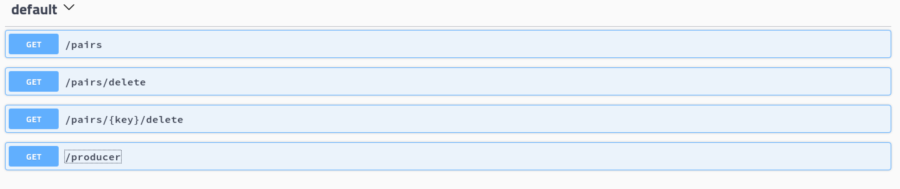

# EAP 7.0.x XA Application with A-MQ 7.0.x

## A-MQ Configuration

```xml
      <address-settings>
        <address-setting match="galileo.#">
                <dead-letter-address>galileo.endpoint.DLQ</dead-letter-address>
                <max-delivery-attempts>3</max-delivery-attempts>
        </address-setting>
      </address-settings>

      <addresses>
        <address name="galileo.endpoint.DLQ">
                <anycast>
                        <queue name="galileo.endpoint.DLQ" />
                </anycast>
        </address>
        <address name="galileo.endpoint">
                <anycast>
                        <queue name="galileo.endpoint" />
                </anycast>
        </address>
      </addresses>
```

## EAP Configuration

1. Outbound socket connection
    ```xml
    <outbound-socket-binding name="remote-artemis">
       <remote-destination host="localhost" port="61616"/>
    </outbound-socket-binding>
    ```
2. Remote connector
    ```xml
    <remote-connector name="remote-artemis" socket-binding="remote-artemis">
    </remote-connector>
    ```
3. Connection Factory
    ```xml
    <pooled-connection-factory name="remote-artemis" transaction="xa" ha="true" entries="java:/JmsRemoteXA java:/jms/remoteCF" connectors="remote-artemis"/>
    ```
4. Use jndi for artemis queue.
    ```xml
            <subsystem xmlns="urn:jboss:domain:naming:2.0">
                <bindings>
                    <external-context name="java:global/remoteContext" module="org.apache.activemq.artemis" class="javax.naming.InitialContext">
                        <environment>
                            <property name="java.naming.factory.initial" value="org.apache.activemq.artemis.jndi.ActiveMQInitialContextFactory"/>
                            <property name="java.naming.provider.url" value="tcp://localhost:61616"/>
                            <property name="queue.testQueue" value="galileo.endpoint"/>
                        </environment>
                    </external-context>
                    <lookup name="java:/testQueue" lookup="java:global/remoteContext/testQueue"/>
                </bindings>
                <remote-naming/>
            </subsystem>
    ```

## Build and Deploy

1. Build application with command:

        mvn clean install

2. Deploy to local eap instance with command:

        mvn wildfly:deploy

## Test the transaction

1. Open the browser to test the rest endpoint

    > [http://localhost:8080/xa-app](http://localhost:8080/xa-app)
    
    
    
    1. */producer*  to send a message
    2. */pairs*  to read all message
    3. */pairs/{key}/delete* to delete a msg per key
    4. */pairs/delete* to delete all msg


2. Simulate rollback scenario

    Uncomment the following line (54) on **PairConsumer.java**
    
    ```java
        pairService.setWithRollback(new Pair(message.getJMSMessageID(), textMessage.getText()));
    ```
